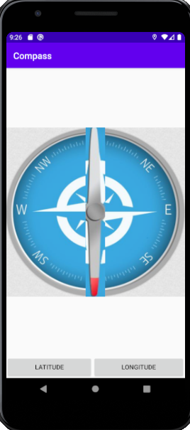
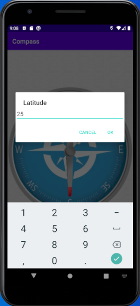

"# Compass v.0.2"

Have to do:

Improve UI

Unit tests

Fix problem with delayed coordinate updating (destination point). Dialog response handling problem

Add displaying destination point based on calculated angle (from true north)

